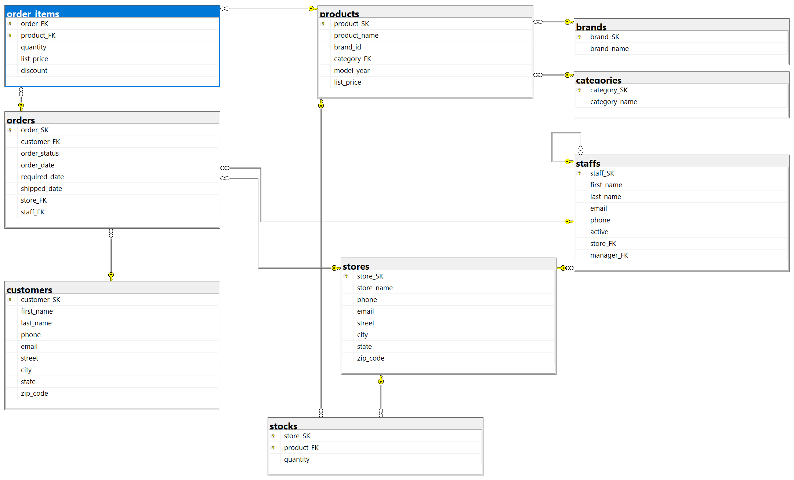
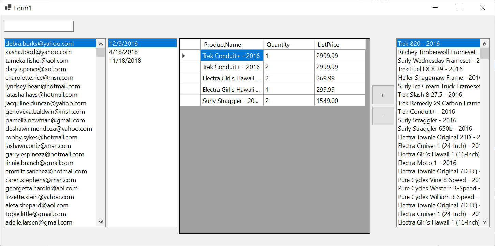

# Bike Store - minta ZH

## Adatbázis

```powershell
Install-Package Microsoft.EntityFrameworkCore.SqlServer
Install-Package Microsoft.EntityFrameworkCore.Tools
```

```powershell
Scaffold-DbContext "Data Source=bit.uni-corvinus.hu;Initial Catalog=se_bikestore;User ID=hallgato;Password=Password123" Microsoft.EntityFrameworkCore.SqlServer -OutputDir Models
```



## Szükséges táblák

#### `customers` &rarr; `orders` &rarr; `oreder items` &larr; `products`




## Lépések

(+/-) Hozd létre a projektet, és a fenti adatok alapján készítsd el az adatkötött osztályokat!

(+/-) Készítsd el az ábrán látható felhasználói felületet!

(+/-) A bal `ListBox`-ban jelenítsd meg szűrhető módon a `customers` tábla elemeit, a listában az `email` mező értéke jelenjen meg!

(+/-) A bal jobb`ListBox`-bn jelenítsd a `products` tábla elemeit, a listában az `product_name` mező értéke jelenjen meg! Itt már nincs szükség szűrésre. 

(+/-) Ha a felhasználó kiválaszt egy `customer`-t a bal listából, jelenjenek meg a második listában a hozzá tartozó megrendelések az `orders` táblából. A megjelenített mező az `order_date` legyen!

(+/-) Hozd létre az alábbi osztályt, mely a rács adatforrásául szolgál:

``` csharp
public class DetailedOrderItem
{
    public int OrderFk { get; set; }
    public int ProductFk { get; set; }
    public string ProductName { get; set; } = null!;
    public int Quantity { get; set; }
    public decimal? ListPrice { get; set; }
}
```

(+/-) A rács "fülén" keresztül vedd fel adatkötött adatforrásként az előbb létrehezott `DetailedOrderItem` osztályt, majd állítsd be a rács adatforrásaként. 

(+/-) A második listára kattintva jelnjenek meg a kiválasztott `Models.Order`-hez a hozzá tartozó `OrderItem`-ek `DetailedOrderItem`  fromában. Az adatkötés a `BindingSource`-on keresztül történjen!

(+/-)  A `+` gombra kattintva lehessen új ` Models.OrderItem` típisú elemet felvenni az `context.OrderItems` gyűjteménybe. A mennyiség most minen esetben 1. Az adatbázisban történő rögzítés után az elemek kerüljenek újraolvasásra a rácsba!


